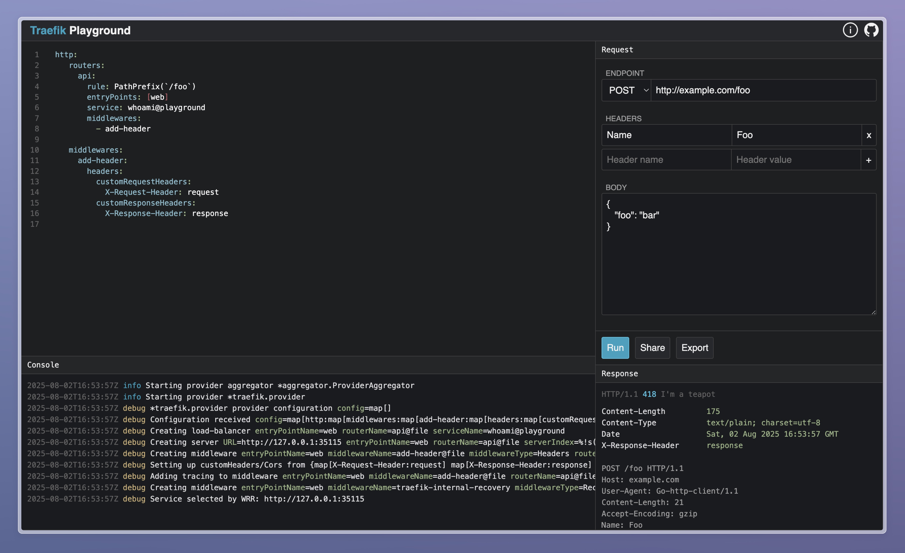

# Traefik Playground

A web-based development environment for experimenting with Traefik configurations. Test routing rules, middleware, and load balancing configurations in an isolated environment with real-time feedback.

**🌐 Try it online at [traefik-playground.com](https://traefik-playground.com)**



## Features

- **Interactive Configuration Editor**: Write and test Traefik dynamic configurations with syntax highlighting
- **Real-Time Preview**: See configuration changes applied instantly in a containerized environment
- **Experiment Sharing**: Save and share configuration experiments via shareable URLs
- **File Provider Support**: Test configurations using Traefik's file provider
- **Built-in Services**: Pre-configured test services for immediate experimentation

## Getting Started

### Prerequisites

- [Nix](https://nixos.org/download.html) package manager

### Installation

1. Clone the repository:
   ```bash
   git clone https://github.com/yourusername/traefik-playground.git
   cd traefik-playground
   ```

2. Start the development environment:
   ```bash
   nix develop
   make dev
   ```

3. Open your browser and navigate to `http://localhost:8080`

### Usage

1. Access the Traefik Playground UI in your browser
2. Write or modify the Traefik dynamic configuration in the editor
3. Click "Run Experiment" to apply the configuration
4. Test your routes and observe the behavior
5. Save and share experiments using the generated URLs

## Contributing

We welcome contributions! Here's how you can help:

1. **Read the architecture documentation** in [docs/architecture.md](docs/architecture.md) to understand the project structure
2. **Fork the repository** and create a feature branch
3. **Make your changes** following the existing code style
4. **Add tests** for any new functionality
5. **Run the test suite** to ensure everything works
6. **Submit a pull request** with a clear description of your changes

### Development Setup

```bash
# Clone your fork.
git clone https://github.com/yourusername/traefik-playground.git
cd traefik-playground

# Set up development environment.
nix develop

# Run in development mode.
make dev
```

Please ensure your code follows the project's coding standards and includes appropriate tests.

## License

This project is licensed under the MIT License - see the [LICENSE](LICENSE) file for details.
