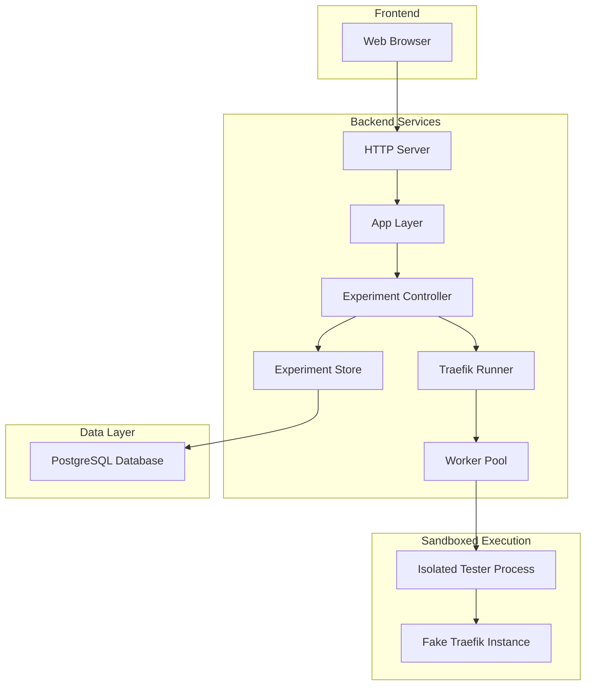

# Traefik Playground Architecture

## Overview

Traefik Playground is a web-based development environment that allows users to experiment with Traefik configurations in real-time. The system provides an interactive configuration editor, executes configurations against a fake Traefik instance, and enables sharing and exporting of experiments.

## High-Level Architecture

## Core Concepts

### Run Bundles & Signatures
The system uses **Run Bundles** to ensure data integrity and prevent storage of invalid experiments:

- **Run Bundle**: A signed container holding both an experiment and its verified result
- **Bundle Signature**: HMAC-SHA256 signature proving the experiment was successfully executed
- **Purpose**: Only experiments that have been successfully tested can be shared, reducing database noise and preventing storage of arbitrary data

### Sandboxed Execution
Traefik experiments run in complete isolation using **BubbleWrap** sandboxing:

- **Process Isolation**: Each experiment runs in a separate sandbox with no access to the host system
- **Filesystem Isolation**: Only the necessary binaries are mounted read-only into the sandbox
- **Network Isolation**: Sandboxed processes cannot access external networks
- **Resource Limits**: CPU and memory usage is controlled per experiment

## Component Architecture

### 1. Entry Point (`cmd/`)

The application has two main entry points:

- **Server Command** (`cmd/server/`): Starts the web application server
- **Tester Command** (`cmd/tester/`): Sandboxed Traefik instance that runs isolated experiments

### 2. Web Application Layer (`app/`)

Provides the user interface and REST API endpoints for experiment operations.

**Key Endpoints:**
- `GET /` - Main experiment interface
- `POST /run` - Execute an experiment  
- `POST /share` - Share an experiment
- `GET /share/{id}` - Retrieve shared experiment
- `POST /export` - Export as docker-compose

### 3. Experiment Controller (`internal/experiment/`)

Orchestrates experiment execution and persistence. The controller validates configurations, runs them through the Traefik runner, and manages sharing through the store.

### 4. Traefik Execution Engine (`internal/traefik/`)

Creates in-memory Traefik instances that process user configurations. The engine:
- Parses YAML configurations into Traefik's internal structures
- Builds HTTP handlers based on the configuration
- Injects test services (like whoami) for experimentation
- Processes HTTP requests and captures results

### 5. Worker Pool (`internal/command/`)

Manages concurrent experiment execution with configurable limits on:
- Maximum concurrent processes
- Queue depth for pending experiments  
- Execution timeouts

### 6. Data Store (`internal/experiment/store.go`)

Persists shared experiments in PostgreSQL with deduplication using SHA-256 hashing. Only experiments with valid run bundles can be stored.
sandboxed execution (included in container)
